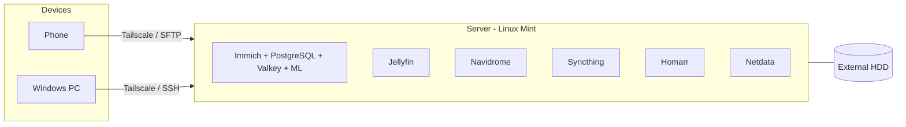

**English** | [Português (BR)](README.pt-BR.md)

# Homelab

A home Linux server built on an old laptop, where I self-host my own services (photos, music, media and file sync) in Docker containers, with remote access over a VPN.

> This repository documents the setup, the problems I ran into and how I solved them. The Portuguese version is in [README.pt-BR.md](README.pt-BR.md).

## Hardware and system

| Item | Details |
|---|---|
| Machine | Repurposed Samsung laptop |
| CPU | Intel Celeron 4205U (2 cores, 1.8 GHz) |
| Memory | 11 GB RAM + zram |
| Storage | 500 GB HDD (5,400 rpm) + external HDD |
| OS | Linux Mint 22.3 |
| Containers | Docker 29 + Docker Compose v2 |
| Remote access | Tailscale (WireGuard-based VPN) + SSH ([key guide](docs/ssh-chave.md)); files from my phone via SFTP (Solid Explorer) |
| Firewall | UFW |

## Services

| Service | What it does | How it runs |
|---|---|---|
| [Immich](https://immich.app) | Backup and gallery for phone photos/videos, with face recognition and machine-learning search | Docker Compose: server, machine learning, PostgreSQL (with vector extensions) and Valkey |
| [Jellyfin](https://jellyfin.org) | Media server | Container on the `servidor_network` network |
| [Navidrome](https://www.navidrome.org) | Streaming for my music library (Subsonic-compatible apps) | Docker Compose, music folder mounted read-only |
| [Syncthing](https://syncthing.net) | File sync between my devices, with no third-party cloud | Docker Compose |
| [Homarr](https://homarr.dev) | Dashboard with shortcuts to all services | Docker Compose |
| [Netdata](https://www.netdata.cloud) | Real-time monitoring of CPU, memory, disk and containers | Container |

Configuration lives in [`stacks/`](stacks/). Passwords and personal paths are kept in a `.env` file that is **not** versioned (see the `.env.example` in each stack).

## Backup

Immich photos and its database are backed up automatically to the external HDD, and the restore has been tested. Reference script: [`scripts/backup-immich.sh`](scripts/backup-immich.sh).

## Architecture



## Problems I ran into and how I solved them

### Laptop keyboard and touchpad stop responding
- **Symptom:** the built-in keyboard and touchpad would suddenly freeze, sometimes right at the login screen. USB devices also failed at times.
- **Investigation:** the graphical interface (XFCE) still responded to clicks, so the system had not crashed. To avoid a forced shutdown (which would bring down the containers and wipe the logs in memory), I used the **Onboard** on-screen keyboard to open a terminal and read the kernel logs. I ruled out hardware failure and video/X11 problems. The logs pointed to the built-in keyboard and touchpad controller (`i8042`).
- **Probable cause:** the kernel was losing communication with the `i8042` controller because of how the laptop firmware (ACPI/PnP) configures it, including in power management.
- **Fix:** I added boot parameters in GRUB so the kernel does not depend on that configuration and resets the controller when needed:
```bash
sudo nano /etc/default/grub
# on the GRUB_CMDLINE_LINUX_DEFAULT line, I added:
# i8042.nopnp=1 i8042.reset
sudo update-grub
sudo reboot
```

### Server files from my phone: connection failing and empty folders
- **Symptom:** managing files from my phone was slow. I used to use FileBrowser in the browser (port 8080), which works well on a PC but is poor on a phone. After switching to the Solid Explorer app, the connection did not work and, when it did connect, it showed empty folders.
- **Investigation:** I tested the app's connection types and ports. I was trying FTP on the web service port (8080), but the server has no FTP: file access goes through SSH.
- **Cause:** (1) wrong protocol and port: the right one is **SFTP**, which uses SSH itself on port 22; (2) the connection opened at the system root (`/`), in `root` folders that my user cannot read, so everything looked empty.
- **Fix:** in Solid Explorer I set up an **SFTP** connection to the server's Tailscale IP, port 22, with the starting path at `/home/<my user>`. Now the server's HDD shows up on Android like a regular folder, and I copy and move files without opening any port to the internet.

### Immich and Homarr showing as `unhealthy` right after boot
- **Symptom:** after restarting the server, `docker ps` showed `immich_server`, `immich_machine_learning` and `homarr` as *unhealthy*.
- **Investigation:** I checked the logs with `docker logs --tail 25 immich_server` and waited for startup to finish.
- **Cause:** on the Celeron with a mechanical HDD, the services take a few minutes to come up, and the *healthcheck* fails in the meantime.
- **Result:** after about 10 minutes, all of them became *healthy* without intervention.

## What I learned

- The difference between named volumes and *bind mounts* (where the Immich photos and database actually live).
- Docker networks: services in the same `docker-compose.yml` find each other by name (e.g. Immich calls `immich-machine-learning:3003`).
- Healthchecks and reading logs to diagnose containers.
- Mesh VPN with Tailscale to reach the server from outside the house without opening router ports.
- Kernel parameters in GRUB (`/etc/default/grub` + `update-grub`) and reading kernel logs to diagnose hardware.
- The difference between FTP and SFTP: SFTP uses SSH itself (port 22), with no extra service to install.
- Linux file permissions: a regular user cannot read `root` folders.
- A backup only counts once you have tested the restore.
