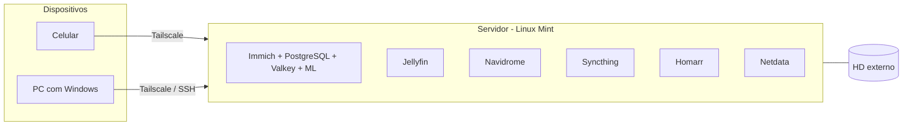

# Homelab

Servidor Linux doméstico montado num notebook antigo, onde hospedo meus próprios serviços (fotos, música, mídia e sincronização de arquivos) em contêineres Docker, com acesso remoto por VPN.

> **English summary:** a home server built from an old Samsung laptop (Intel Celeron 4205U, 11 GB RAM, 500 GB HDD) running Linux Mint 22. It self-hosts Immich, Jellyfin, Navidrome, Syncthing, Homarr and Netdata in Docker containers, with remote access through Tailscale and SSH. This repository documents the setup, the problems I ran into and what I plan to improve.

## Hardware e sistema

| Item | Detalhe |
|---|---|
| Máquina | Notebook Samsung reaproveitado |
| CPU | Intel Celeron 4205U (2 núcleos, 1,8 GHz) |
| Memória | 11 GB RAM + zram |
| Armazenamento | HD de 500 GB (5.400 rpm) + HD externo |
| Sistema | Linux Mint 22.3 |
| Contêineres | Docker 29 + Docker Compose v2 |
| Acesso remoto | Tailscale (VPN sobre WireGuard) + SSH |
| Firewall | UFW |

## Serviços

| Serviço | Para que serve | Como roda |
|---|---|---|
| [Immich](https://immich.app) | Backup e galeria de fotos/vídeos do celular, com reconhecimento facial e busca por machine learning | Docker Compose: servidor, machine learning, PostgreSQL (com extensões vetoriais) e Valkey |
| [Jellyfin](https://jellyfin.org) | Servidor de mídia | Contêiner na rede `servidor_network` |
| [Navidrome](https://www.navidrome.org) | Streaming da minha biblioteca de música (compatível com apps Subsonic) | Docker Compose, pasta de música montada só para leitura |
| [Syncthing](https://syncthing.net) | Sincronização de arquivos entre meus dispositivos, sem nuvem de terceiros | Docker Compose |
| [Homarr](https://homarr.dev) | Painel com atalhos para todos os serviços | Docker Compose |
| [Netdata](https://www.netdata.cloud) | Monitoramento de CPU, memória, disco e contêineres em tempo real | Contêiner |

As configurações estão em [`stacks/`](stacks/). Senhas e caminhos pessoais ficam num arquivo `.env`, que **não** é versionado (veja o `.env.example` de cada stack).

## Arquitetura

## Problemas que encontrei e como resolvi

<!-- Escreva aqui casos REAIS no formato: sintoma, como investigou, causa, solução. -->

### Immich e Homarr aparecendo como `unhealthy` logo após ligar o servidor
- **Sintoma:** depois de reiniciar o servidor, `docker ps` mostrava `immich_server`, `immich_machine_learning` e `homarr` como *unhealthy*.
- **Investigação:** olhei os logs com `docker logs --tail 25 immich_server` e esperei a inicialização terminar.
- **Causa:** no Celeron com HD mecânico, os serviços demoram alguns minutos para subir, e o *healthcheck* falha enquanto isso.
- **Resultado:** depois de cerca de 10 minutos, todos passaram para *healthy* sem intervenção.

### [Seu próximo caso real]
- **Sintoma:**
- **Investigação:**
- **Causa:**
- **Solução:**

## O que aprendi

- Diferença entre volumes nomeados e *bind mounts* (onde ficam de fato as fotos do Immich e o banco de dados).
- Redes Docker: serviços do mesmo `docker-compose.yml` se encontram pelo nome (ex.: o Immich chama `immich-machine-learning:3003`).
- *Healthchecks* e leitura de logs para diagnosticar contêineres.
- VPN mesh com Tailscale para acessar o servidor de fora de casa sem abrir portas no roteador.

## Próximos passos

- [ ] SSH apenas com chave (desativar login por senha). Guia: [`docs/ssh-chave.md`](docs/ssh-chave.md)
- [ ] Backup automático do Immich (banco + fotos) para o HD externo. Script: [`scripts/backup-immich.sh`](scripts/backup-immich.sh)
- [ ] Testar a restauração do backup
- [ ] Migrar os contêineres criados com `docker run` (Jellyfin, Netdata) para Docker Compose
- [ ] Revisar a exposição de portas: o Docker publica portas direto no iptables e contorna as regras do UFW
- [ ] Alertas do Netdata (disco cheio, temperatura)
