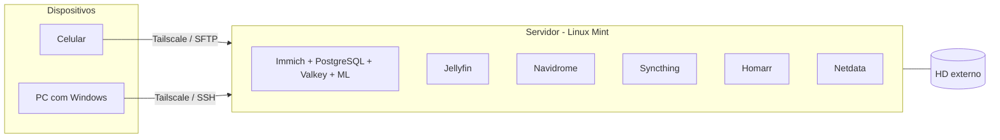

[English](README.md) | **Português (BR)**

# Homelab

Servidor Linux doméstico montado num notebook antigo, onde hospedo meus próprios serviços (fotos, música, mídia e sincronização de arquivos) em contêineres Docker, com acesso remoto por VPN.

> **English summary:** a home server built from an old Samsung laptop (Intel Celeron 4205U, 11 GB RAM, 500 GB HDD) running Linux Mint 22. It self-hosts Immich, Jellyfin, Navidrome, Syncthing, Homarr and Netdata in Docker containers, with remote access through Tailscale and SSH. This repository documents the setup, the problems I ran into and what I plan to improve.

## Hardware e sistema

| Item | Detalhe |
|---|---|
| Máquina | Notebook Samsung reaproveitado |
| CPU | Intel Celeron 4205U (2 núcleos, 1,8 GHz) |
| Memória | 11 GB RAM + zram |
| Armazenamento | HD de 500 GB (5.400 rpm) + HD externo |
| Sistema | Linux Mint 22.3 |
| Contêineres | Docker 29 + Docker Compose v2 |
| Acesso remoto | Tailscale (VPN sobre WireGuard) + SSH ([guia de chave](docs/ssh-chave.pt-BR.md)); arquivos pelo celular via SFTP (Solid Explorer) |
| Firewall | UFW |

## Serviços

| Serviço | Para que serve | Como roda |
|---|---|---|
| [Immich](https://immich.app) | Backup e galeria de fotos/vídeos do celular, com reconhecimento facial e busca por machine learning | Docker Compose: servidor, machine learning, PostgreSQL (com extensões vetoriais) e Valkey |
| [Jellyfin](https://jellyfin.org) | Servidor de mídia | Contêiner na rede `servidor_network` |
| [Navidrome](https://www.navidrome.org) | Streaming da minha biblioteca de música (compatível com apps Subsonic) | Docker Compose, pasta de música montada só para leitura |
| [Syncthing](https://syncthing.net) | Sincronização de arquivos entre meus dispositivos, sem nuvem de terceiros | Docker Compose |
| [Homarr](https://homarr.dev) | Painel com atalhos para todos os serviços | Docker Compose |
| [Netdata](https://www.netdata.cloud) | Monitoramento de CPU, memória, disco e contêineres em tempo real | Contêiner |

As configurações estão em [`stacks/`](stacks/). Senhas e caminhos pessoais ficam num arquivo `.env`, que **não** é versionado (veja o `.env.example` de cada stack).

## Backup

As fotos e o banco de dados do Immich têm backup automático para o HD externo, e a restauração já foi testada. Script de referência: [`scripts/backup-immich.sh`](scripts/backup-immich.sh).

## Arquitetura



## Problemas que encontrei e como resolvi

### Teclado e touchpad do notebook param de responder
- **Sintoma:** o teclado e o touchpad internos travavam de repente, às vezes já na tela de login. Dispositivos USB também falhavam em alguns momentos.
- **Investigação:** a interface gráfica (XFCE) continuava respondendo a cliques, então o sistema não tinha travado. Para não forçar o desligamento (o que derrubaria os contêineres e apagaria os logs da memória), usei o teclado virtual **Onboard** para abrir o terminal e ler os logs do kernel. Descartei falha física e problema de vídeo/X11. Os logs apontaram para o controlador de teclado e touchpad internos (`i8042`).
- **Causa provável:** o kernel perdia a comunicação com o controlador `i8042` por causa da forma como o firmware do notebook (ACPI/PnP) configura esse controlador, inclusive no gerenciamento de energia.
- **Solução:** adicionei parâmetros de boot no GRUB para o kernel não depender dessa configuração e reiniciar o controlador quando necessário:
  ```bash
  sudo nano /etc/default/grub
  # na linha GRUB_CMDLINE_LINUX_DEFAULT, acrescentei:
  #   i8042.nopnp=1 i8042.reset
  sudo update-grub
  sudo reboot
  ```

### Arquivos do servidor pelo celular: conexão falhando e pastas vazias
- **Sintoma:** gerenciar arquivos pelo celular era lento. Antes eu usava o FileBrowser no navegador (porta 8080), que funciona bem no PC mas é ruim no celular. Ao trocar para o app Solid Explorer, a conexão não funcionava e, quando conectava, mostrava pastas vazias.
- **Investigação:** testei os tipos de conexão do app e as portas. Eu estava tentando FTP na porta do serviço web (8080), mas o servidor não tem FTP: o acesso a arquivos é pelo SSH.
- **Causa:** (1) protocolo e porta errados: o certo é **SFTP**, que usa o próprio SSH na porta 22; (2) a conexão abria na raiz do sistema (`/`), em pastas do `root` que o meu usuário não pode ler, por isso aparecia tudo vazio.
- **Solução:** configurei no Solid Explorer uma conexão **SFTP** para o IP do servidor no Tailscale, porta 22, com o caminho inicial em `/home/<meu usuário>`. Agora o HD do servidor aparece no Android como uma pasta comum, e copio e movo arquivos sem abrir nenhuma porta para a internet.

### Immich e Homarr aparecendo como `unhealthy` logo após ligar o servidor
- **Sintoma:** depois de reiniciar o servidor, `docker ps` mostrava `immich_server`, `immich_machine_learning` e `homarr` como *unhealthy*.
- **Investigação:** olhei os logs com `docker logs --tail 25 immich_server` e esperei a inicialização terminar.
- **Causa:** no Celeron com HD mecânico, os serviços demoram alguns minutos para subir, e o *healthcheck* falha enquanto isso.
- **Resultado:** depois de cerca de 10 minutos, todos passaram para *healthy* sem intervenção.

## O que aprendi

- Diferença entre volumes nomeados e *bind mounts* (onde ficam de fato as fotos do Immich e o banco de dados).
- Redes Docker: serviços do mesmo `docker-compose.yml` se encontram pelo nome (ex.: o Immich chama `immich-machine-learning:3003`).
- *Healthchecks* e leitura de logs para diagnosticar contêineres.
- VPN mesh com Tailscale para acessar o servidor de fora de casa sem abrir portas no roteador.
- Parâmetros do kernel no GRUB (`/etc/default/grub` + `update-grub`) e leitura de logs do kernel para diagnosticar hardware.
- Diferença entre FTP e SFTP: o SFTP usa o próprio SSH (porta 22), sem instalar outro serviço.
- Permissões de arquivos no Linux: um usuário comum não lê as pastas do `root`.
- Backup só vale depois de testar a restauração.
